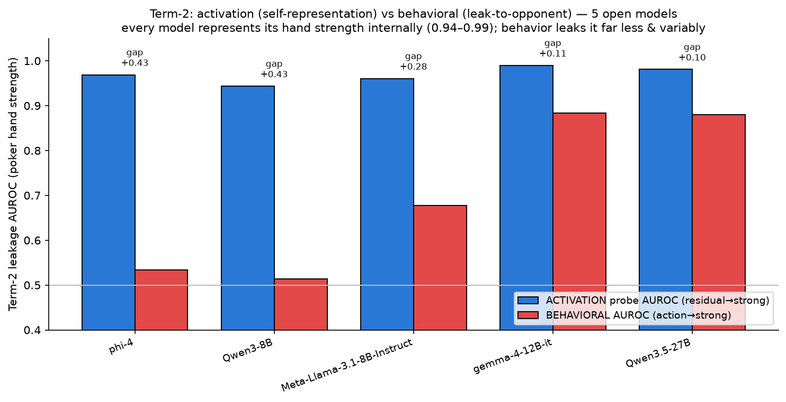

# Term-2, second implementation — activation probe vs behavioral leakage (white-box, open models)

The plan called for a **second Term-2 meter**: "an activation probe using [a] value-leakage
direction — the second gives you a cleaner causal signal. Validate them against each other." This
implements it and validates it across **5 open-weights models**.

**Why open models only (and why this does NOT change the frontier).** Activations require white-box
access; the whole deception study ran on **closed** frontier models via OpenRouter, whose activations
are unavailable. So an activation probe can only run on open models executed locally — it is a
*parallel methodological track*, not an upgrade to the frontier's numbers. And the last audit already
established that leakage is the clean, load-bearing axis while the *gain* axis is the variance-limited
one — the probe touches the leakage half, which was already the healthy half.

## Method
- **Spots** (`build_probe_spots.py`, eval7): 1095 poker decisions (395 real from `poker_crossplay`
  + 700 synthetic), each with **exact hand equity** as the private-type ground truth. Binary subset:
  312 strong (equity ≥ 0.60) / 328 weak (< 0.40).
- **Capture** (`activation_probe.py`, performative venv): run the open model on each spot; grab the
  **residual stream at the last prompt token, every layer**, from one `generate` call that also
  yields the model's own action.
- **Activation leakage** = standardized logistic probe (5-fold CV) predicting strong-vs-weak from the
  residual → AUROC by layer (+ a ridge probe regressing continuous equity → Pearson r). The fitted
  best-layer direction (diff-of-means + weights) is saved to `probes/probe_pokerstrength_<tag>_last.npz`.
- **Behavioral leakage** = AUROC of the model's own **ordinal action** (Fold<Check<Call<Bet/Raise)
  predicting a strong hand — the same channel the frontier uses, on the same model+spots.

## Result — robust across families and sizes (not model-specific)

| model | activation AUROC (layer) | equity Pearson r | behavioral AUROC | gap (act−beh) |
|---|---|---|---|---|
| gemma-4-12B-it | **0.99** (L32/48) | 0.87 | 0.88 | +0.11 |
| Qwen3.5-27B | **0.98** (L51/64) | 0.83 | 0.88 | +0.10 |
| phi-4 | **0.97** (L22/40) | 0.82 | 0.53 | **+0.43** |
| Meta-Llama-3.1-8B-Instruct | **0.96** (L17/32) | 0.77 | 0.68 | +0.28 |
| Qwen3-8B | **0.94** (L29/36) | 0.75 | 0.51 | **+0.43** |

- **Every model represents its hand strength internally near-ceiling (activation AUROC 0.94–0.99)**,
  peaking at a mid-to-late layer (~50–70% depth). This is stable across 5 families/sizes → the signal
  is real and not model-specific.
- **Behavioral leakage varies widely (0.51–0.88).** Two models (Qwen3-8B 0.51, phi-4 0.53) are
  behaviorally near-chance — they play passively and barely express strength in actions — while
  gemma-4-12B and Qwen3.5-27B act on it (0.88).
- **The gap (act − beh) is always positive (+0.10 … +0.43)**: the internal representation is always
  at least as strong as, and often far stronger than, what leaks behaviorally.

## What it means (and the key nuance)
- **The two meters answer different questions.** In poker the private type (your cards) is *in your
  own prompt*, so a probe reading "how strong am I" from mid-layer activations is partly just decoding
  visible input — high activation AUROC is *expected*, not secret knowledge. The activation probe is a
  **self-representation** meter; the behavioral meter is the **leakage-to-opponent** meter. They are
  **complementary axes, not two estimates of one quantity** — a subtlety the "value-leakage direction"
  framing glosses over.
- **What the probe validates:** low behavioral leakage is a genuine *concealment policy*, not a failure
  to represent the type — the model always represents its strength (≥0.94); it just may not act on it.
  So the frontier's behavioral leakage numbers reflect real behavioral concealment, which is
  reassuring for the half the whole study rests on.
- **The gap is a per-model concealment signature:** passive "knows-but-doesn't-act" models (Qwen3-8B,
  phi-4: gap +0.43) vs "plays-its-strength" models (gemma/Qwen-27B: +0.10). This is a cleaner,
  causal-ready quantity (you can steer along the saved direction) than the behavioral meter alone.

## Does improving the Term-2 probe make the results better?
- **For the frontier's headline conclusions: no.** It can't measure the closed frontier models, and
  the binding limitation there is gain-axis variance / small-n, not the leakage meter.
- **As a methodological addition: yes, modestly.** It adds a robust, cheap, causal-ready
  self-representation meter, validates that behavioral concealment is real (not a representation gap),
  and gives the per-model concealment-gap signature. It is the natural white-box counterpart for
  future intervention/steering work.

## Caveats / next
- **Single game (poker) and type-in-prompt.** The clean test of *concealment* would be a game where
  the model must *infer* a hidden state (opponent's type) rather than read its own — then a high probe
  AUROC would be genuine hidden knowledge. Poker measures self-representation; extend to opponent-type
  probing next.
- 640 binary spots, one linear probe, 5-fold CV; equity thresholds 0.40/0.60. Behavioral meter is the
  model's greedy no-think action on a re-posed spot (not full-game play).
- Saved directions (`probes/probe_pokerstrength_*_last.npz`) enable a causal follow-up: steer along
  the direction and measure the effect on the model's action (does removing the strength signal change
  its bet/fold?) — the true Term-2b causal test.

Artifacts (`deception_poc/`): `build_probe_spots.py`, `activation_probe.py`, `spots.jsonl`,
`activation_probe_results_<tag>.json`, `activation_probe_<tag>.png`, `activation_probe_summary.{png,json}`,
`probes/probe_pokerstrength_<tag>_last.npz`. Run in the `performative/.venv` (torch+sklearn), 8×H200.
