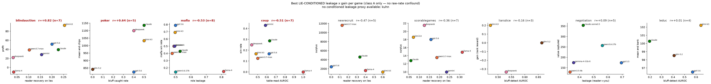

# Best LIE-CONDITIONED leakage proxy per game (class A only)

After a source-code audit (`COND` in `proxy_grid.py`), only class-**A** leakage proxies are conditioned on the lie event and thus free of the raw-deception-rate confound. Raw rates (**B**: `bluff_rate`, `misrep`, `claim_honesty`) and unconditioned mixes (**C**: `tell`/`tell_size`, `leakage rho`, liarsdice `own_frac` leakage) all move mechanically with how *often* the model lies, so they are excluded here. Combined scatter: `best_conditioned.png`. Sign: negative r = concealment-pays (low leakage -> high gain). Bold = |r| >= 0.5.

| game | class-A leakage (x) | gain (y) | Pearson r | n |
|---|---|---|---:|---:|
| blindauction | reader recovery on lies | profit | **+0.82** | 7 |
| poker | bluff caught rate | mean end chips | **+0.64** | 5 |
| mafia | role leakage | mafia win rate | **-0.53** | 8 |
| coup | table-read AUROC | win rate | **-0.51** | 7 |
| newrecruit | reader recovery on lies | surplus | -0.47 | 5 |
| scorablegames | reader recovery on lies | surplus | -0.36 | 7 |
| liarsdice | bluff-detect AUROC | gain (rank reward) | -0.16 | 3 |
| negotiation | leakage (reader->you) | value captured | +0.09 | 5 |
| leduc | bluff-detect AUROC | mean end bank | +0.01 | 4 |

### Games with NO usable lie-conditioned leakage proxy

| game | why |
|---|---|
| poker | only `tell`/`tell_size` (C, AUROC over all hands) + `bluff_rate` (B) |
| kuhn | only `tell` (C) + `bluff_rate` (B) |
| leduc | only `tell` (C) + `bluff_rate` (B) |
| liarsdice | `bluff_stick_rate` (A) is empty/n<3; rest are C/B |
| blindauction | only `leakage rho` (C) + `misrep` (B) |
| newrecruit | only `leakage rho` (C) + `misrep` (B) |
| scorablegames | only `leakage rho` (C) + `misrep` (B) |
