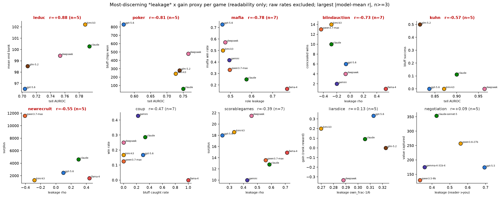

# Best (most-discerning) *leakage* proxy pairing per game

One row per game: the **genuine-leakage** (Term-2, readability) x gain (Term-1) pairing with the largest |model-mean Pearson r| (computable, n>=3). Raw-rate / inference proxies (`bluff_rate`, `misrep`, `bluff_stick_rate`, `claim_honesty`, `table_read_auroc`) are **excluded** — they measure how *often* a model deceives, or how well it reads others, not how readable it is. Combined scatter: `best_per_game.png`. Sign: leakage axes are *higher = more readable*; gain *higher = better*, so **negative r = concealment-pays** (low leakage -> high gain). Bold = |r| >= 0.5.

| game | Term-2 leakage (x) | Term-1 gain (y) | Pearson r | n |
|---|---|---|---:|---:|
| leduc | tell AUROC | mean end bank | **+0.88** | 5 |
| poker | tell AUROC | bluff chips won | **-0.81** | 5 |
| mafia | role leakage | mafia win rate | **-0.78** | 7 |
| blindauction | leakage rho | concealed wins | **-0.73** | 7 |
| kuhn | tell AUROC | bluff success | **-0.57** | 5 |
| newrecruit | leakage rho | surplus | **-0.55** | 5 |
| coup | bluff caught rate | win rate | -0.47 | 7 |
| scorablegames | leakage rho | surplus | -0.39 | 7 |
| liarsdice | leakage own_frac-1/6 | gain (rank reward) | +0.13 | 5 |
| negotiation | leakage (reader->you) | value captured | +0.09 | 5 |
