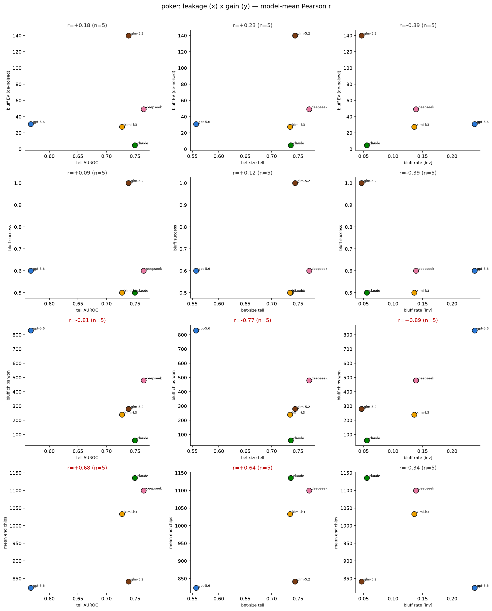
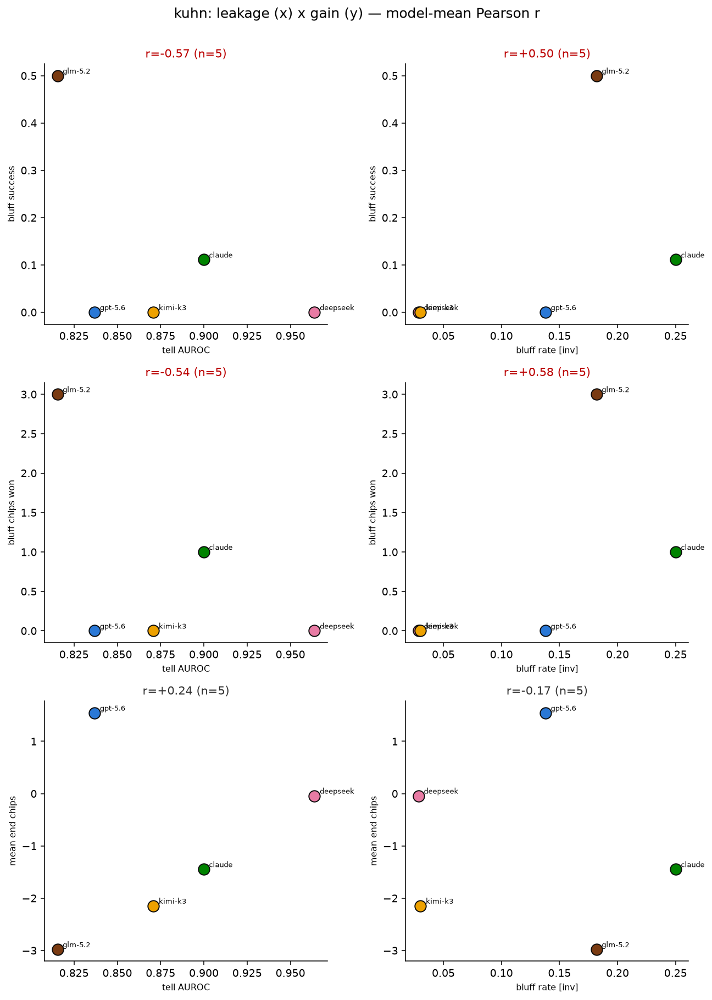
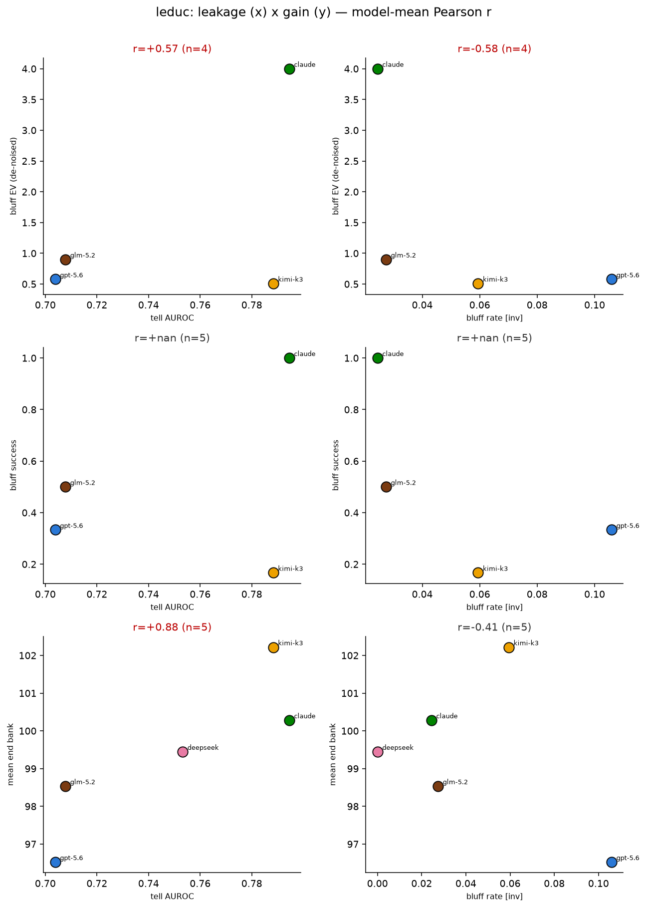
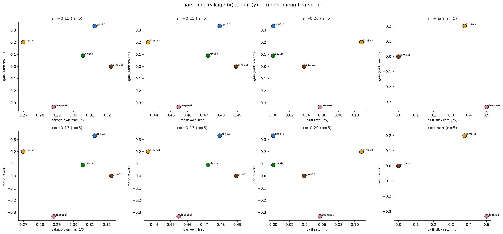
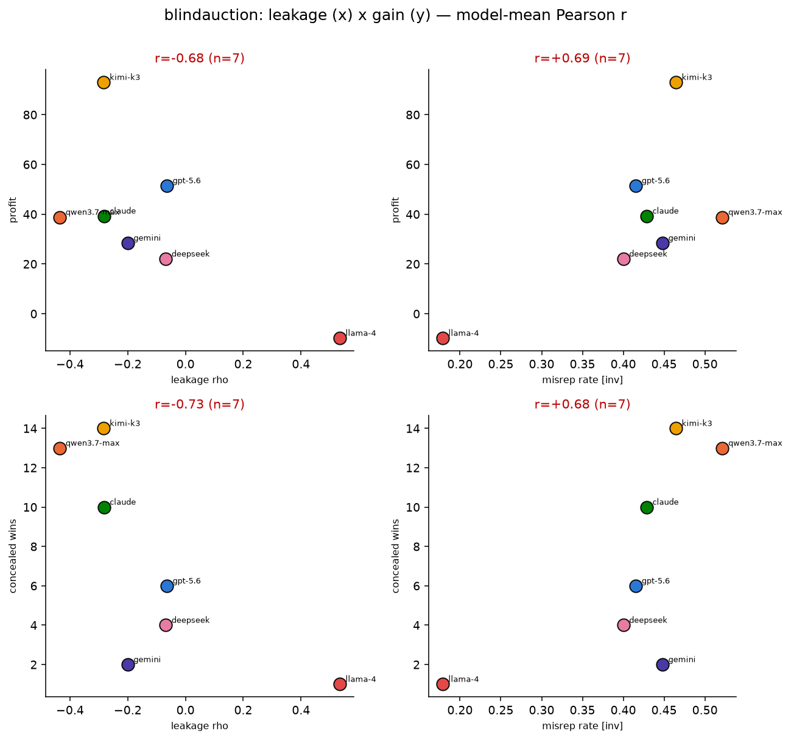
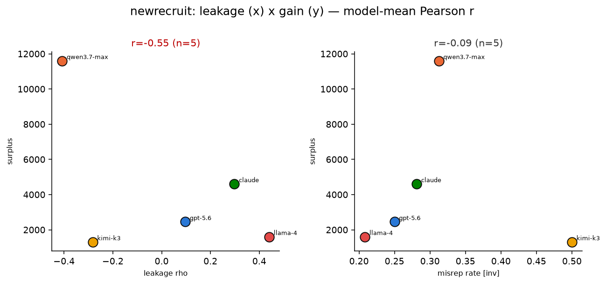
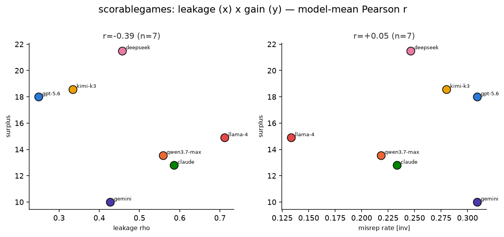
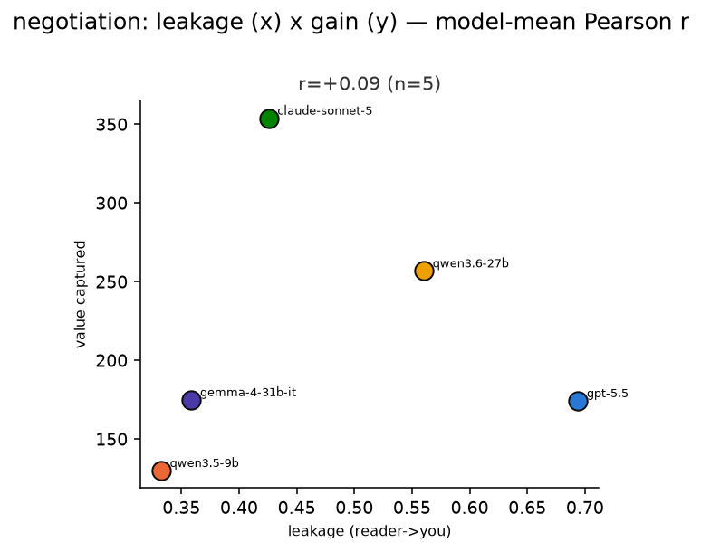
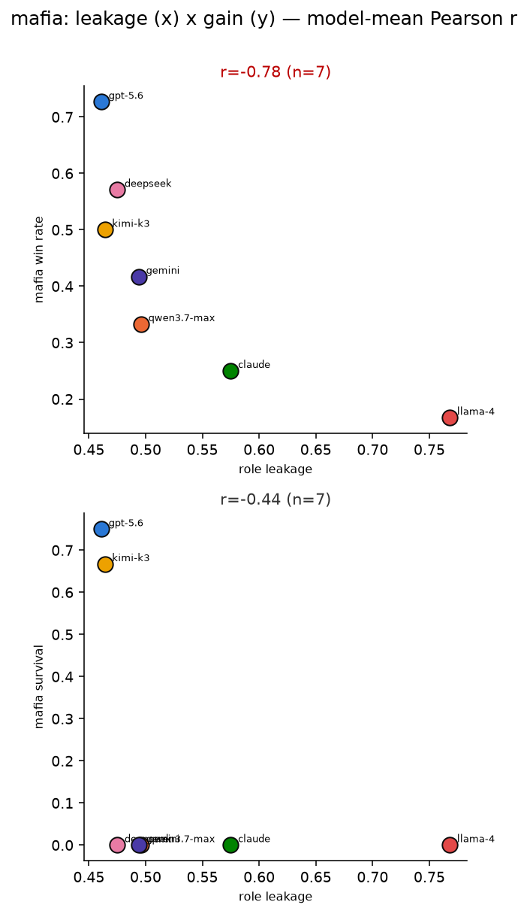
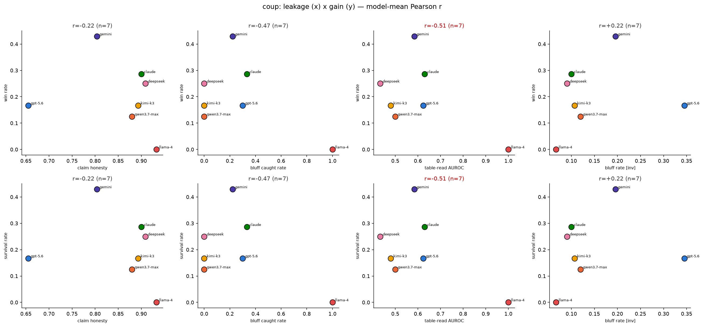

# Proxy combinations — which Term-2 x Term-1 pairing is most discerning

Model-mean **Pearson r** for every leakage (Term-2) x gain (Term-1) proxy pairing, per game, from the per-model numbers in `../*_results.json` (no rollouts/LLM). Sign: leakage axes are *higher = more readable* unless tagged **(inv)** = higher = more deceptive; gain axes are *higher = better*. So a **negative r** on a readable-leakage axis = the **concealment-pays** direction. `|r|` ranks discernment; **n** = models (small — treat as directional). Bold = |r| >= 0.5.

## poker

| Term-2 leakage (x) | Term-1 gain (y) | Pearson r | n |
|---|---|---:|---:|
| bluff rate (inv) | bluff chips won | **+0.89** | 5 |
| tell AUROC | bluff chips won | **-0.81** | 5 |
| bet-size tell | bluff chips won | **-0.77** | 5 |
| tell AUROC | mean end chips | **+0.68** | 5 |
| bet-size tell | mean end chips | **+0.64** | 5 |
| bluff rate (inv) | bluff success | -0.39 | 5 |
| bluff rate (inv) | bluff EV (de-noised) | -0.39 | 5 |
| bluff rate (inv) | mean end chips | -0.34 | 5 |
| bet-size tell | bluff EV (de-noised) | +0.23 | 5 |
| tell AUROC | bluff EV (de-noised) | +0.18 | 5 |
| bet-size tell | bluff success | +0.12 | 5 |
| tell AUROC | bluff success | +0.09 | 5 |

## kuhn

| Term-2 leakage (x) | Term-1 gain (y) | Pearson r | n |
|---|---|---:|---:|
| bluff rate (inv) | bluff chips won | **+0.58** | 5 |
| tell AUROC | bluff success | **-0.57** | 5 |
| tell AUROC | bluff chips won | **-0.54** | 5 |
| bluff rate (inv) | bluff success | **+0.50** | 5 |
| tell AUROC | mean end chips | +0.24 | 5 |
| bluff rate (inv) | mean end chips | -0.17 | 5 |

## leduc

| Term-2 leakage (x) | Term-1 gain (y) | Pearson r | n |
|---|---|---:|---:|
| tell AUROC | mean end bank | **+0.88** | 5 |
| bluff rate (inv) | bluff EV (de-noised) | **-0.58** | 4 |
| tell AUROC | bluff EV (de-noised) | **+0.57** | 4 |
| bluff rate (inv) | mean end bank | -0.41 | 5 |
| tell AUROC | bluff success | n/a | 5 |
| bluff rate (inv) | bluff success | n/a | 5 |

## liarsdice

| Term-2 leakage (x) | Term-1 gain (y) | Pearson r | n |
|---|---|---:|---:|
| bluff rate (inv) | gain (rank reward) | -0.20 | 5 |
| bluff rate (inv) | mean reward | -0.20 | 5 |
| leakage own_frac-1/6 | gain (rank reward) | +0.13 | 5 |
| leakage own_frac-1/6 | mean reward | +0.13 | 5 |
| mean own_frac | gain (rank reward) | +0.13 | 5 |
| mean own_frac | mean reward | +0.13 | 5 |
| bluff-stick rate (inv) | gain (rank reward) | n/a | 5 |
| bluff-stick rate (inv) | mean reward | n/a | 5 |

## blindauction

| Term-2 leakage (x) | Term-1 gain (y) | Pearson r | n |
|---|---|---:|---:|
| leakage rho | concealed wins | **-0.73** | 7 |
| misrep rate (inv) | profit | **+0.69** | 7 |
| misrep rate (inv) | concealed wins | **+0.68** | 7 |
| leakage rho | profit | **-0.68** | 7 |

## newrecruit

| Term-2 leakage (x) | Term-1 gain (y) | Pearson r | n |
|---|---|---:|---:|
| leakage rho | surplus | **-0.55** | 5 |
| misrep rate (inv) | surplus | -0.09 | 5 |

## scorablegames

| Term-2 leakage (x) | Term-1 gain (y) | Pearson r | n |
|---|---|---:|---:|
| leakage rho | surplus | -0.39 | 7 |
| misrep rate (inv) | surplus | +0.05 | 7 |

## negotiation

| Term-2 leakage (x) | Term-1 gain (y) | Pearson r | n |
|---|---|---:|---:|
| leakage (reader->you) | value captured | +0.09 | 5 |

## mafia

| Term-2 leakage (x) | Term-1 gain (y) | Pearson r | n |
|---|---|---:|---:|
| role leakage | mafia win rate | **-0.78** | 7 |
| role leakage | mafia survival | -0.44 | 7 |

## coup

| Term-2 leakage (x) | Term-1 gain (y) | Pearson r | n |
|---|---|---:|---:|
| table-read AUROC | win rate | **-0.51** | 7 |
| table-read AUROC | survival rate | **-0.51** | 7 |
| bluff caught rate | win rate | -0.47 | 7 |
| bluff caught rate | survival rate | -0.47 | 7 |
| bluff rate (inv) | win rate | +0.22 | 7 |
| bluff rate (inv) | survival rate | +0.22 | 7 |
| claim honesty | win rate | -0.22 | 7 |
| claim honesty | survival rate | -0.22 | 7 |

## Most discerning pairings across ALL games

| game | leakage | gain | r | n |
|---|---|---|---:|---:|
| poker | bluff rate (inv) | bluff chips won | +0.89 | 5 |
| leduc | tell AUROC | mean end bank | +0.88 | 5 |
| poker | tell AUROC | bluff chips won | -0.81 | 5 |
| mafia | role leakage | mafia win rate | -0.78 | 7 |
| poker | bet-size tell | bluff chips won | -0.77 | 5 |
| blindauction | leakage rho | concealed wins | -0.73 | 7 |
| blindauction | misrep rate (inv) | profit | +0.69 | 7 |
| poker | tell AUROC | mean end chips | +0.68 | 5 |
| blindauction | misrep rate (inv) | concealed wins | +0.68 | 7 |
| blindauction | leakage rho | profit | -0.68 | 7 |
| poker | bet-size tell | mean end chips | +0.64 | 5 |
| leduc | bluff rate (inv) | bluff EV (de-noised) | -0.58 | 4 |
| kuhn | bluff rate (inv) | bluff chips won | +0.58 | 5 |
| leduc | tell AUROC | bluff EV (de-noised) | +0.57 | 4 |
| kuhn | tell AUROC | bluff success | -0.57 | 5 |
| newrecruit | leakage rho | surplus | -0.55 | 5 |
| kuhn | tell AUROC | bluff chips won | -0.54 | 5 |
| coup | table-read AUROC | win rate | -0.51 | 7 |
| coup | table-read AUROC | survival rate | -0.51 | 7 |
| kuhn | bluff rate (inv) | bluff success | +0.50 | 5 |
