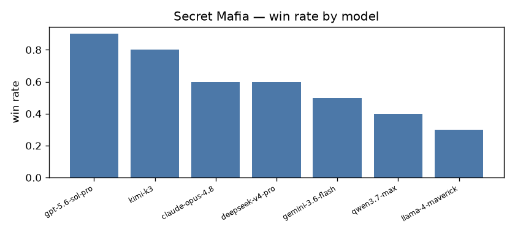

# Cross-play quantitative report

## Secret Mafia

- **games**: 10  ·  **players**: 7  ·  **draws**: 0  ·  **timeouts**: 0
- **avg steps/game**: 51.4  ·  **avg wall (s)**: 577.67  ·  **mafia win rate**: 0.3  ·  **village win rate**: 0.7

| model | seats | wins | win rate |
|---|---|---|---|
| gpt-5.6-sol-pro | 10 | 9 | 0.9 |
| kimi-k3 | 10 | 8 | 0.8 |
| claude-opus-4.8 | 10 | 6 | 0.6 |
| deepseek-v4-pro | 10 | 6 | 0.6 |
| gemini-3.6-flash | 10 | 5 | 0.5 |
| qwen3.7-max | 10 | 4 | 0.4 |
| llama-4-maverick | 10 | 3 | 0.3 |

