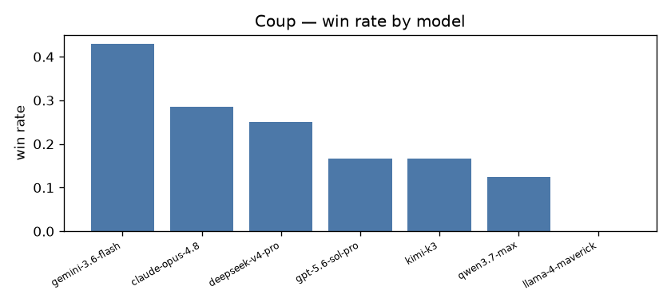

# Cross-play quantitative report

## Coup · `base`

- **games**: 10  ·  **players**: 5  ·  **draws**: 0  ·  **timeouts**: 0
- **avg steps/game**: 83.8  ·  **avg wall (s)**: 788.98

| model | seats | wins | win rate |
|---|---|---|---|
| gemini-3.6-flash | 7 | 3 | 0.429 |
| claude-opus-4.8 | 7 | 2 | 0.286 |
| deepseek-v4-pro | 8 | 2 | 0.25 |
| gpt-5.6-sol-pro | 6 | 1 | 0.167 |
| kimi-k3 | 6 | 1 | 0.167 |
| qwen3.7-max | 8 | 1 | 0.125 |
| llama-4-maverick | 8 | 0 | 0.0 |

