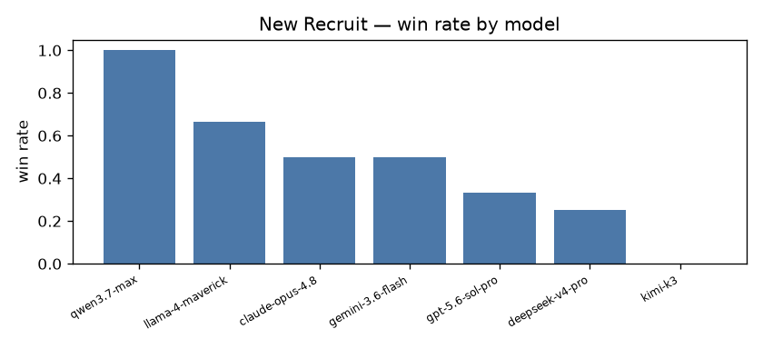
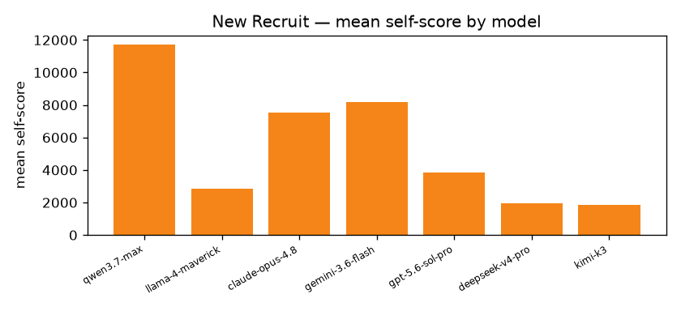

# Cross-play quantitative report

## New Recruit · `base`

- **games**: 10  ·  **players**: 2  ·  **draws**: 1  ·  **timeouts**: 0
- **avg steps/game**: 8.3  ·  **avg wall (s)**: 182.55  ·  **agreement rate**: 1.0  ·  **mean efficiency**: 0.69

| model | seats | wins | win rate | mean self-score | mean value-extraction |
|---|---|---|---|---|---|
| qwen3.7-max | 2 | 2 | 1.0 | 11700.0 | 0.79 |
| llama-4-maverick | 3 | 2 | 0.667 | 2866.67 | 0.19 |
| claude-opus-4.8 | 4 | 2 | 0.5 | 7550.0 | 0.51 |
| gemini-3.6-flash | 2 | 1 | 0.5 | 8200.0 | 0.55 |
| gpt-5.6-sol-pro | 3 | 1 | 0.333 | 3866.67 | 0.26 |
| deepseek-v4-pro | 4 | 1 | 0.25 | 1975.0 | 0.13 |
| kimi-k3 | 2 | 0 | 0.0 | 1850.0 | 0.12 |

