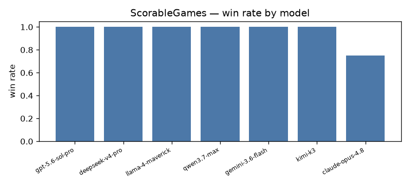
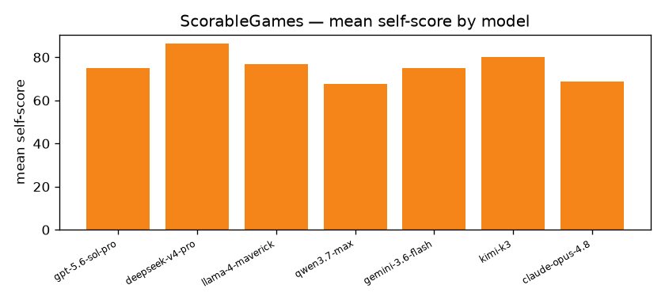

# Cross-play quantitative report

## ScorableGames · `vendor_retailer`

- **games**: 10  ·  **players**: 2  ·  **draws**: 0  ·  **timeouts**: 0
- **avg steps/game**: 13.0  ·  **avg wall (s)**: 196.22  ·  **agreement rate**: 1.0  ·  **mean efficiency**: 0.98

| model | seats | wins | win rate | mean self-score | mean value-extraction |
|---|---|---|---|---|---|
| gpt-5.6-sol-pro | 3 | 3 | 1.0 | 75.0 | 0.61 |
| deepseek-v4-pro | 4 | 4 | 1.0 | 86.25 | 0.71 |
| llama-4-maverick | 3 | 3 | 1.0 | 76.67 | 0.63 |
| qwen3.7-max | 2 | 2 | 1.0 | 67.5 | 0.55 |
| gemini-3.6-flash | 2 | 2 | 1.0 | 75.0 | 0.61 |
| kimi-k3 | 2 | 2 | 1.0 | 80.0 | 0.65 |
| claude-opus-4.8 | 4 | 3 | 0.75 | 68.75 | 0.56 |

