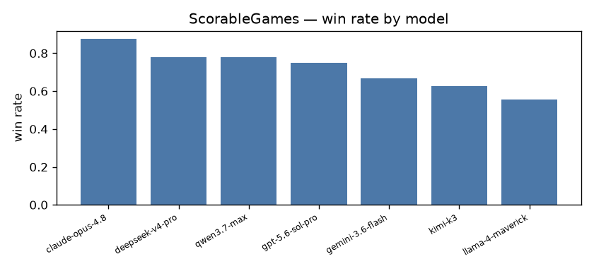
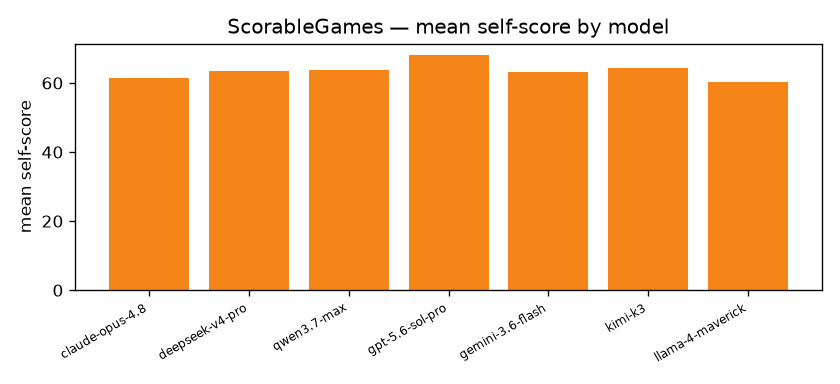

# Cross-play quantitative report

## ScorableGames · `base`

- **games**: 10  ·  **players**: 6  ·  **draws**: 2  ·  **timeouts**: 0
- **avg steps/game**: 34.3  ·  **avg wall (s)**: 649.85  ·  **agreement rate**: 1.0  ·  **mean efficiency**: 0.92

| model | seats | wins | win rate | mean self-score | mean value-extraction |
|---|---|---|---|---|---|
| claude-opus-4.8 | 8 | 7 | 0.875 | 61.5 | 0.61 |
| deepseek-v4-pro | 9 | 7 | 0.778 | 63.56 | 0.64 |
| qwen3.7-max | 9 | 7 | 0.778 | 63.89 | 0.64 |
| gpt-5.6-sol-pro | 8 | 6 | 0.75 | 68.0 | 0.68 |
| gemini-3.6-flash | 9 | 6 | 0.667 | 63.22 | 0.63 |
| kimi-k3 | 8 | 5 | 0.625 | 64.25 | 0.64 |
| llama-4-maverick | 9 | 5 | 0.556 | 60.22 | 0.6 |

