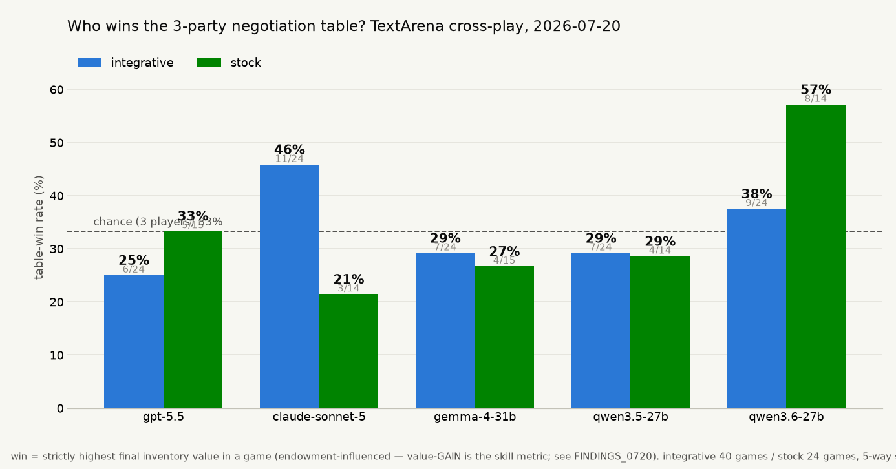
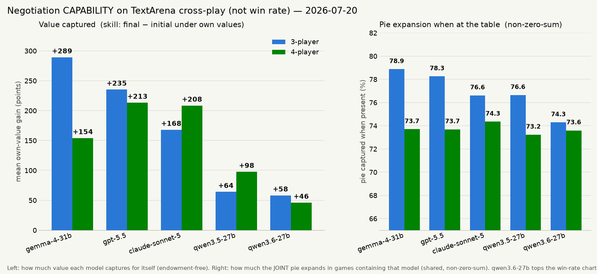

# TextArena cross-play negotiation — overnight findings (2026-07-20)

Env: TextArena's N-player `Negotiation` (5 resources, private per-resource
values, public broadcast + private whisper + bilateral trade offers,
accept/deny). Ported to the current TextArena core (registry entry was stale/
commented out — `FFAMultiPlayerState`, `observation_type`, `set_invalid_move`
signature; patches in `textarena/envs/Negotiation/env.py`). Runner
`run_crossplay.py` drives each seat with a (different) model via OpenRouter,
injects each seat's live holdings per turn (the env only shows new messages),
and computes negotiation-quality metrics the built-in winner-take-all reward
discards. Analysis `analyze.py`, judge `judge_xp.py`.

**value_gain** = final − initial inventory value under a seat's OWN private
values (the negotiation-skill signal; not zero-sum because trades expand the
pie). **integrative_ratio** = realized joint value / max achievable (each unit
to its highest-valuer). Seats rotate models each game so every model plays
every position.s

Batches (all judged with claude-sonnet-4.6):
`xp_3p_integrative` (40), `xp_4p_integrative` (40), `xp_3p_stock` (24).

## Figures

*The myopic view.* Win = strictly highest **final inventory value** in a game.
qwen3.6-27b tops it (57% stock, 38% integrative) — but win rate is
endowment-dominated: a passive model that keeps its (good) starting endowment
and barely trades holds the biggest pile at the buzzer. **Win rate rewards
sitting still. Do not use it for capability or base selection.**

*The honest view.* Left: mean own-value **gain** (final − initial;
endowment-free — the extraction-skill metric). Right: **integrative ratio when
present** (how much the joint pie expands in games containing that model;
shared, non-zero-sum). The two charts **invert** the win-rate one: qwen3.6-27b
is *last* in value captured (+58/+46) and lowest in pie expansion (74.3%),
while gemma/gpt/sonnet capture 3–5× more. That inversion is the point — score
capability by gain/pie-expansion, never by win rate.
(Reproduce: `plot_winrates.py`, `plot_capability.py`.)

## Headline: the gap is NOT in the frontier — it's the open models under-trading in mixed company

The regime that produced the sharpest signal is the wide-valuation
("integrative") one, where ~25% of joint value is unlocked only by trading.
Per-model average own-value **gain** and trade participation:

**3-player integrative (40 games, pie expansion ratio 0.77):**

| model | value gain | offers/game | accepts/game | invalid |
|---|---|---|---|---|
| gemma-4-31b-it | **+289** | 2.4 | 5.0 | 0.04 |
| gpt-5.5 | +235 | 21.1 | 1.2 | 0.17 |
| claude-sonnet-5 | +168 | 1.6 | 6.2 | 0.08 |
| qwen3.5-27b | +64 | 5.7 | 0.8 | 0.04 |
| **qwen3.6-27b** | **+58** | **0.9** | **0.9** | 0.00 |

**4-player integrative (40 games, ratio 0.74):**

| model | value gain | offers/g | accepts/g | invalid |
|---|---|---|---|---|
| gpt-5.5 | +213 | 18.4 | 1.6 | 0.19 |
| claude-sonnet-5 | +208 | 1.2 | 4.5 | 0.00 |
| gemma-4-31b-it | +154 | 4.8 | 3.8 | 0.00 |
| qwen3.5-27b | +98 | 4.7 | 1.9 | 0.03 |
| **qwen3.6-27b** | **+46** | **0.9** | **0.4** | 0.03 |

**The reversal that matters for post-training:** qwen3.6-27b *won every
self-play table* in the earlier base hunt, but here — cross-played against
frontier + gemma — it is the **weakest value-capturer in the field**, at both
player counts. Mechanism is visible in the participation columns: it makes
~0.9 offers and ~0.9 accepts per *game* (i.e. it mostly broadcasts and never
closes), so it leaves the integrative surplus on the table for others to take.
Its gain is small-positive, not negative — it is **passive, not exploited**.
Self-play hid this completely: when everyone under-trades symmetrically, the
(smaller) pie still splits evenly and qwen3.6 looked dominant.

**Frontier models do not show a capability gap here — they capture the most
surplus.** Two behavioral notes:
- gpt-5.5 wins on gain by *flooding* offers (18–21 per game) but pays for it
  with the field's highest invalid-move rate (0.17–0.19) — it occasionally
  spams malformed/over-committed offers and gets penalized/eliminated. A
  discipline wart, not a strategy gap.
- sonnet-5 and gemma win by being **accept-heavy** (5–6 accepts/game): they
  let others propose and take the good deals. Efficient and low-invalid (0.00–
  0.08). Different, cleaner style than gpt-5.5's offer-flood.

## Regime contrast confirms the integrative variant is the discriminative one

`xp_3p_stock` (env-default ±20% values): pie-expansion ratio starts at 0.92
(almost no headroom), integrative gain averages +18 (vs +489 integrative),
and all models cluster near zero gain (gpt-5.5 +51, rest ~0 to −16). With
little to trade for, the game can't separate models. **Use wide/independent
valuations for any negotiation eval or RL reward — the stock spread is too
distributive to be informative.**

## Deception / value concealment (judge)

3-player integrative (judge = sonnet-4.6; reader reconstructs a seat's values
from its outward messages only → MAE ↓ = concealed; deception = self-value
claims that misrepresent, benefited_frac = fraction that helped the speaker):

| model | msg-value MAE | spearman | deception rate | benefited | claims |
|---|---|---|---|---|---|
| gpt-5.5 | 6.68 | 0.82 | **0.193** | 0.97 | 161 |
| claude-sonnet-5 | 4.05 | 0.69 | 0.187 | 0.91 | 123 |
| qwen3.5-27b | 5.67 | 0.68 | 0.110 | 0.91 | 100 |
| gemma-4-31b-it | **0.96** | 0.92 | 0.101 | 0.72 | 247 |
| qwen3.6-27b | 6.08 | 0.48 | 0.055 | 1.00 | 55 |

- **The frontier lies most, and profitably** (gpt-5.5 / sonnet-5 deception
  ~0.19 at 0.91–0.97 benefited) — same "effective misrepresentation"
  signature as in the harness; part of their gain lead is earned by strategic
  value-misrepresentation, not just trade volume.
- **gemma wins while being the most transparent** (MAE 0.96 — a reader
  recovers its values almost exactly): it trades toward efficient allocations
  in the open, not by concealment. A genuinely different, cooperative style.
- **qwen3.6-27b makes the fewest value claims of anyone** (55 in 3p, 44 in
  4p, vs 100–310 for the rest) — the passivity signature again: it barely
  engages the value-revelation game.

4-player judge (`xp_4p_integrative/judge_summary.json`) — what replicates vs
what doesn't: **replicates** — qwen3.6 fewest claims (passivity); gemma most
transparent (MAE 0.61, lowest); gpt-5.5 the top liar (0.20). **Does not** —
qwen3.6's per-claim deception rate jumps 0.055→0.136 (but on only 44 claims,
so noisy), and sonnet-5's drops 0.187→0.089. So the *behavioral roles*
(passive / transparent-efficient / deceptive-frontier) are stable; the exact
deception rates are not — small per-model claim counts, read directionally.

## Implications for training a superhuman negotiator

1. **Cross-play is mandatory for base selection.** Self-play efficiency is not
   cross-play extraction — they *disagreed on the winner*. qwen3.6-27b's
   self-play dominance was an artifact of symmetric under-trading.
2. **The concrete trainable gap is trade *initiative/conversion*, not talk.**
   The open models (esp. qwen3.6-27b) negotiate verbally but fail to convert
   to executed offers/accepts. A reward on realized own-value gain in
   cross-play against a frontier/gemma opponent pool directly targets this.
3. **gemma-4-31b is the strongest open trader here** (+289 3p) and a good
   opponent-pool anchor; frontier (gpt-5.5/sonnet-5) as the ceiling.
4. Metric hygiene: score `value_gain` (own-value Δ), not the built-in
   winner-take-all reward (endowment-dominated) and not raw win rate.

Caveats: gain is not zero-sum (pie expands) so it rewards participation as
well as extraction — but the participation columns show qwen3.6's low gain is
genuine passivity, not a metric artifact. 12 turns/player, temp 0.7, single
judge. Frontier invalid-move rate partly reflects the strict TextArena action
grammar, not only model error.
